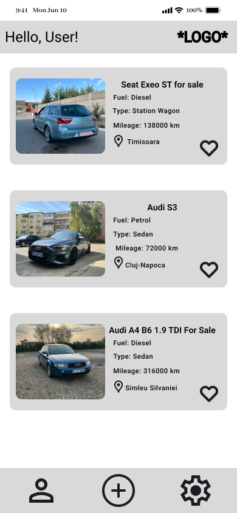
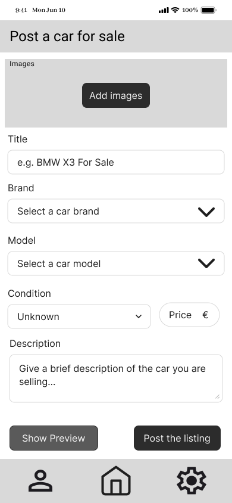

# Project Idea

As a client I would like a mobile application which allows users to post their cars for sale. It should provide an easy-to-use interface with a minimal and simple design so features are easily accessible for the users.

### Requirements

- The app must allow users to post car listings with minimal steps - set a title, give some details about the vehicle, upload photos and choose a price.
- The details about the car must include the car's make and model, year, mileage, fuel type (relevant info regarding a vehicle).
- The user should be able to upload multiple photos of the car.
- Searching a listing should be done using various filters according to the details of the vehicle (brand, model, fuel type etc.)
- The result of a search can also be sorted based on price, year, mileage etc.
- A user must be able to mark a certain listing as favourite for easy access later.
- Browsing the listings does not require authentication, but if a user wants to post a car for sale, they must create an account or authenticate prior to it.

### Domain details

The main entity is the listing, which has the following fields:

- Title - the text which is displayed as a heading on a listing
- Description - extra information given by the seller about the car
- Price - the price of the vehicle for sale
- Condition - the current state of the car for sale (e.g. brand new, good, fair, bad etc.)
- Brand - the make of the vehicle (e.g. BMW, Audi etc.)
- Model - the model of the car according to the brand
- Fuel Type - which type of fuel is used (e.g. Diese, Petrol, Hybrid, Electric)
- Body Style - the shape of the body of the vehicle (e.g. Sedan, Station Wagon, Coupe etc.)
- Colour - the colour of the body
- ManufactureYear - the year in which the car was produced
- Mileage - the number of the KM's the car has travelled
- Emission Standard - (e.g. Euro 4, Euro 5 etc.)
- Seller details - (e.g. Name, Country, City)
- CreatedAt - the date when the listing was added

### CRUD Operations

- CREATE - An user creates a new listing and posts it. After that it should be visible for all other users.
- READ - When a user opens up the application they can see in a list the newest car listings posted.
- UPDATE - The user which created a car listing can modify it. They can update all details about their car listing.
- DELETE - The user which posted a car for sale can delete the listing (e.g. when the car is sold)

### Persistence Details

- When an user creates a new listing and submits it it is persisted on the server so that every other user can access it. For the user that posted it the listing is created locally, without fetching all listings again. 
- When the users browses the application listings are read only once from the server and then they are persisted locally so the number of requests to the server is minimal.
- If an user updates a listing then a request is made to the server to modify it on the database, but on the client-side of the user that modified the listing only that particular listing is modified locally. (No GET request made)
- When the user deletes a car listing, the request is made to the server where it is removed, but fetching all listings again is not allowed (the listing is deleted from the local dataset).

### Offline Access
 
- CREATE - The new listing is saved locally as a draft so the user can post it again when they are online.
- READ - The latest version of the data is saved locally, so when the user is offline, they can browse the listing which were stored on the device.
- UPDATE - Similar to the CREATE scenario, the new details are saved as a draft so the user can submit the changes when they are back online.
- DELETE - Deleting a listing while offline does not affect either the local memory nor the server when the user comes back online.

### Screenshots

Browsing cars for sale     |  Create a new listing
:-------------------------:|:-------------------------:
     |  